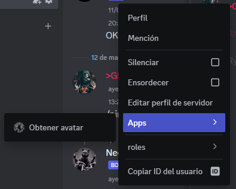

<p align="center" >
    <a href="http://nestjs.com/" target="blank"></a></br>
    <a href="https://necord.org/" target="blank"></a>
    <a href="https://necord.org/" target="blank"></a>
</p>


---
Haz click para ver.

<details>
<summary id="descargo-de-responsabilidad">Descargo de Responsabilidad:</summary>

<p>Este bot de Discord, utilizando la biblioteca Necord, tiene fines recreativos y de entretenimiento. 
La información proporcionada por el bot puede no ser completamente precisa o actualizada. No me hago responsable de las decisiones tomadas basándose en la información proporcionada por el bot.

El uso del bot está sujeto a cambios sin previo aviso. No garantizamos la disponibilidad continua, la funcionalidad o la precisión de los comandos proporcionados.

Este bot puede contener enlaces a sitios web de terceros. No respaldamos ni asumimos responsabilidad por el contenido de esos sitios.

Los usuarios son responsables de cumplir con los términos de servicio de Discord y cualquier otra regulación aplicable al utilizar este bot.

Al utilizar este bot, aceptas este descargo de responsabilidad y los términos de uso asociados.</p>
</details>

---

## Descripción rápida

#### Este es un proyecto basado en Necord realizado sobre Nest a modo de prueba y tutorial (pero en español).

___

## Antes de empezar, necesitamos instalar algunas cositas:


[//]: # (> ### TIP )
>> Cabe aclarar que es necesario tener instalado [Node.js](https://nodejs.org/)


### Instalar [Necord](https://necord.org/), y su dependencia [Discord.js](https://discord.js.org/)
```bash
$ yarn add necord discord.js
```

### CLI: Interfaz de Línea de Comandos

```bash
$ yarn global add @nestjs/cli
#Comandos propios de Necord
$ yarn add --dev @necord/schematics
```

# Configuración inicial del bot
Primero y principal necesitamos configurar nuestro bot con el token que nos provee Discord.

[Discord Developer Portal](https://discord.com/developers/applications)
> 1. New Aplication.
> 2. Ingresamos el nombre de como lo llamaremos al bot y aceptamos términos.
> 3. Nos vamos a la pestaña **Bot** y presionamos en **Reset token** para obtener nuestro token.
> 4. Lo copiamos y anotamos para el siguiente paso.
> 5. Vamos a la pestaña **OAuth**.
> 6. En **Default Authorization Link** elegimos **In-app Authorization**.
> 7. Nos aparecen los **SCOPES**, seleccionamos **bot** y **applications.commands**.
> 8. Luego, en **BOT PERMISSIONS** elegimos los permisos que veas más adecuados al desarrollo.
> 9. Una ves seleccionados, en la parte inferior de la página se generará un enlace, el cual es al que debes ir para agregar el bot a tu servidor.
> > ###### **NOTA**: Guarda el enlace para uso futuro
## Variables de entorno

Construyo las variables de entorno en el archivo ```.env``` para la configuracion de token y futuras propiedades:

> Renombrar ```.env-template``` a ```.env```

### Instalamos dependencias:
Éstas dependencias nos permitirán hacer uso de las variables de entorno:
```bash
$ yarn add @nestjs/config dotenv
```
e importamos `ConfigModule.forRoot()` en el modulo `app.module.ts`.

<details>
  <summary><code aria-atomic="true">Código: app.module.ts</code></summary>

```typescript
import { Module } from '@nestjs/common';
import { ConfigModule } from "@nestjs/config";

@Module({ 
  imports: [
    ConfigModule.forRoot(),
  ],
  controllers: [], 
  providers: [],
})
export class AppModule {}
```
</details>

Luego, importamos `NecordModule.forRoot()` y configuramos nuestra variable de entorno con el mismo nombre que se encontraba en `.env` de la siguiente manera:
````typescript
NecordModule.forRoot({
  token: process.env.ENV_TOKEN_NAME,
})
````
<details>
  <summary><code aria-atomic="true">Código: app.module.ts</code></summary>

```typescript
import { Module } from '@nestjs/common';
import { ConfigModule } from "@nestjs/config";
import { NecordModule } from "necord";

@Module({ 
  imports: [
    ConfigModule.forRoot(),
    NecordModule.forRoot({
      token: process.env.DISCORD_TOKEN,
      //y agregamos y guild para empezar a detectar el token y levantar bot
      intents: [IntentsBitField.Flags.Guilds],
    }),
  ],
  controllers: [], 
  providers: [],
})
export class AppModule {}
```
</details>

Una vez realizado todo lo anterior, ya podemos poner en marcha para probar por primera vez nuestro bot funcionando:
```bash
$ yarn start:dev
```

>  ###### NOTA:
>  ###### Para los casos en que el bot no responda o funcione incorrectamente mientras hacemos pruebas, pero nuestro código está corriendo sin errores:
>  ###### 1. Expulsar el bot del servidor
>  ###### 2. Volver a invitarlo mediante el enlace que guardamos en un comienzo.
> > ###### Esta falla suele suceder, debido a la cache de discord. Para evitar demoras en las pruebas, la desinstalacion e instalacion del bot genera una nueva caché dejando invalidada la anterior.
> 
> 
> 
___

# Ahora comenzemos...
## Slash command

Para poder realizar los comandos de barra diagonal ( **/** ) o slash command, primero generamos un nuevo recurso:

```bash
$ nest g res slash-commands
```
Solo nos quedaremos con el **module** y **services**. (Lo demas se puede eliminar por el momento).

Con el decorador `@SlashCommand()` podemos empezar a generar el primer comando de barra diagonal o 'Slash command'.

Para generarlo, deberemos ingresar algunas propiedades, principalmente `name` que hacer referencia al comando `/name`, y `description` para mostrar una descripción del comando:

```typescript
@SlashCommand({
  name: 'ping',
  description: 'Ping-Pong Command',
})
```
Luego, usamos el decorador ``@Context`` para enviar argumentos, en este caso ``[interaction]`` y del tipo ``SlashCommandContext``

```typescript
@SlashCommand({
  name: 'ping',
  description: 'Ping-Pong Command',
})
public async onPing(@Context() [interaction]: SlashCommandContext){
  ....
}
```
Y para devolver la respuesta por mensaje, retornamos la respuesta de `[interaction]` mediante ``.reply`` añadiendo la propiedad ``content`` y el valor a retornar.

```typescript
return interaction.reply({ content: 'Pong!' });
```

<details>
  <summary><code aria-atomic="true">Código: slash-commands.service.ts</code></summary>

```typescript
import { Injectable } from '@nestjs/common';
import { Context,
  SlashCommand,
  SlashCommandContext
} from 'necord';

@Injectable()
export class SlashCommandsService {

  @SlashCommand({
    name: 'ping',
    description: 'Ping-Pong Command',
  })
  public async onPing(@Context() [interaction]: SlashCommandContext) {
    return interaction.reply({ content: 'Pong!' });
  }
}
```
</details>

---
## Context menus

Para generar menues contextuales, tanto en usuarios ccomo mensajes, usaremos el decorador ``@UserCommand()``. Agregandole la propiedad `name:` nombraremos nuestra opcion del menu.

```typescript
 @UserCommand({ name: 'Obtener avatar' })
    public async getUserAvatar(
        @Context() [interaction]: UserCommandContext,
        ...
    ) {
        return interaction.reply({
          ....
        });
    }
```



Para esto podriamos hacer, por ejemplo un embed que nos muestre el nombre del usuario y la imagen de perfil.

1. Primero agregaremos `@TargetUser() user: User` para obtener el usuario.
2. Retornaremos, en este caso, un embed, conformado solo por el el nombre del usuario y la imagen de perfil.
```typescript
@UserCommand({ name: 'Obtener avatar' })
public async getUserAvatar(
  @Context() [interaction]: UserCommandContext,
  @TargetUser() user: User
) {
  return interaction.reply({
    embeds: [
      new EmbedBuilder().setTitle(`Avatar de ${user.username}`).setImage(user.displayAvatarURL({size:4096}))
    ]
  });
}
```

>###### Puede ver más en [EmbedBuilder](https://discord.js.org/)
El resultado de este código sera de la siguiente manera:\


---